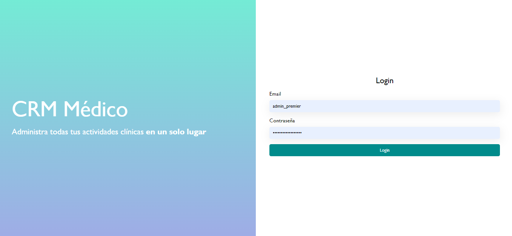

# CRM Medico

Este sistema es un CRM que funciona con un .csv como base de datos y con PHP vanilla.

## Tech Stack

- XAMPP
- PHP 8

## Como instalar

1. Descarga el código como un ZIP
2. Guardalo en <TUUNIDADDEDISCODURO>:/xampp/htdocs/
3. Extrae todos los archivos, y elimina el zip
4. Activa Xampp
5. Accede a localhost/crmmedico

## Credenciales de prueba:

User: test@test.com
Password: test

## Archivos independientes

Existe una serie de archivos independientes en la raiz de la aplicación

### Archivos de PHP

- index.php: Punto de entrada de la aplicación.
- csv_functions.php: Funciones para el manejo de operaciones con archivos tipo .csv (comma-separated values)
- globals.php: Archivo que define constantes usadas a lo largo del programa.
- middleware.php: Archivo con funciones que son utilizadas para manejar la autenticacion y las sesiones
- notfound.php: Archivo estandar para rutas no definidas en el sistema.
- utils.php: Archivo con funciones genéricas

### Archivos de Estilos

- styles.css

# Carpetas de utilidades:

- auth: Carpeta donde se definen las rutas de login y logout.
- components: Carpeta donde se definen funciones de componentes.
- partials: Carpeta donde se incluyen elementos de HTML reutilizados a lo largo de la aplicación

# Carpetas de rutas

Estas carpetas contienen los archivos usados en cada una de las rutas de las aplicaciones

- citas
- diagnosticos
- medicos
- pacientes
- users

Cada una de estas carpetas a su vez, tiene 5 archivos:

- index.php
- agregar.php
- editar.php
- actualizar.php
- eliminar.php

Existe una diferencia en una de las carpetas: la carpeta `pacientes`, la cual incluye un archivo `history.php`, que se usa para realizar la visualiación del historial médico del paciente.
